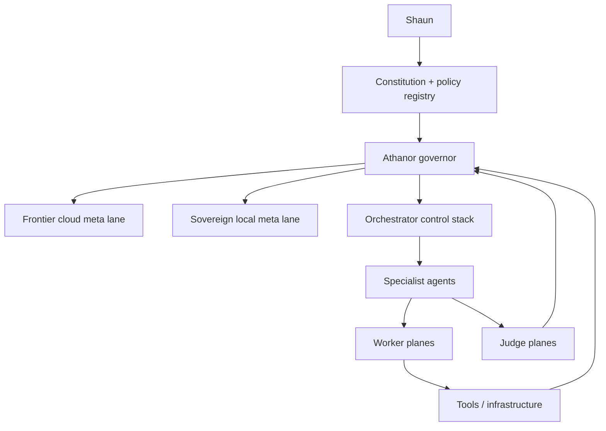

# Command Hierarchy Atlas

This atlas page is a reference map of who commands Athanor, how work is routed, and where sovereignty is enforced. Live authority remains in the registry-backed control plane and current operating docs.

For the design rationale and research anchors, see [../design/command-hierarchy-governance.md](../design/command-hierarchy-governance.md). For the formal decision, see [../decisions/ADR-023-command-hierarchy-and-governance.md](../decisions/ADR-023-command-hierarchy-and-governance.md). For the model-role, workload, and proving-ground layer beneath this hierarchy, see [MODEL_GOVERNANCE_ATLAS.md](./MODEL_GOVERNANCE_ATLAS.md).

## Plain-language map

## Authority order

| Order | Layer | Responsibility | Status |
| --- | --- | --- | --- |
| 1 | Shaun | final approvals, vision, overrides | `live` |
| 2 | Constitution + policy registry | hard constraints, approval bands, cloud boundaries | `live` |
| 3 | Athanor governor | posture, fallback, release-tier, and low-risk automation control | `live` |
| 4 | Meta strategy layer | planning, critique, review, decomposition | `live` |
| 5 | Orchestrator control stack | routing, execution control, shared attention, escalation | `live` |
| 6 | Specialist agents | domain-scoped execution | `live` |
| 7 | Worker / judge planes | bulk execution and scoring | workers `live`, judges `live` |
| 8 | Tools and infrastructure | governed resources only | `live` |

## Meta lanes

| Lane | Lead | Default workload posture | Cloud allowed | Status |
| --- | --- | --- | --- | --- |
| Frontier cloud meta lane | Claude | `cloud_safe`, `private_but_cloud_allowed`, `hybrid_abstractable` | yes | `live` |
| Sovereign local meta lane | local sovereign supervisor | `refusal_sensitive`, `sovereign_only` | no | `live` |

## Control stack

| Subsystem | Role | Main entrypoints | Status |
| --- | --- | --- | --- |
| Agent server | runtime boundary and API front door | `/health`, `/v1/chat/completions`, `/v1/agents`, `/v1/models` | `live` |
| Router | workload triage and processing-tier selection | `/v1/routing/classify` | `live` |
| Task engine | durable work, approvals, result state | `/v1/tasks`, `/v1/tasks/runs` | `live` |
| Scheduler | recurring jobs and schedule introspection | `/v1/tasks/scheduled`, `/v1/scheduling/status` | `live` |
| Workspace / GWT | shared attention, broadcast, endorsements | `/v1/workspace*` | `live` |
| Workplanner | goals, workplan generation, redirects | `/v1/goals`, `/v1/workplan*` | `live` |
| Alerts / escalation | notification posture, operator escalation | `/v1/notifications*`, `/v1/escalation*`, `/v1/notification-budget` | `live` |
| Subscription broker | provider leasing and cloud-boundary enforcement | `/v1/subscriptions*` | `live` |
| Capacity governor | queue, provider-reserve, and node-posture arbitration surfaced through governor posture | `/v1/governor` | `live` |

## Rights summary

| Layer | Allowed | Not allowed |
| --- | --- | --- |
| Governor | route work, choose fallback, enforce posture, and pause or resume controlled execution | override constitution, own durable tasks, issue leases directly, own schedules |
| Meta lanes | plan, review, critique, decompose, suggest redirects | direct tool execution, direct schedule ownership, direct lease issuance |
| Specialists | scoped tool use inside policy bounds | self-expanding authority |
| Workers | generate or transform outputs | approvals, routing, schedules |
| Judges | score or gate outputs | production mutation |

## Policy classes

| Policy class | Meaning | Default meta lane |
| --- | --- | --- |
| `cloud_safe` | normal allowed work | frontier cloud |
| `private_but_cloud_allowed` | private but policy-permitted for cloud use | frontier cloud |
| `hybrid_abstractable` | cloud sees abstracted structure only; raw content stays local | frontier cloud with sovereign raw execution |
| `refusal_sensitive` | likely provider-refused or fragile content | sovereign local |
| `sovereign_only` | never leaves the cluster | sovereign local |

## Operational governance posture

The command hierarchy now includes explicit supporting governance layers that constrain how the governor behaves:

| Layer | What it adds | Status |
| --- | --- | --- |
| System constitution | no-go rules, sovereignty, approval bands, local-only domains | `live` |
| Capacity governor | arbitration order and time-window posture | `live` |
| Economic governance | premium reserves and downgrade order | `live_partial` |
| Presence model | at-desk / away / asleep / phone-only posture plus heartbeat-driven effective state | `live_partial` |
| Data lifecycle registry | retention and cloud-boundary posture by data class | `configured` |
| Backup / restore readiness | critical stores and recovery order | `live_partial` |
| Release ritual | offline eval -> shadow -> sandbox -> canary -> production | `configured` |

## Operator-facing surfaces

These runtime and dashboard surfaces now expose command-hierarchy truth:

| Surface | Purpose | Status |
| --- | --- | --- |
| `/v1/system-map` | read-only runtime hierarchy snapshot | `live` |
| `/v1/governor` | governor posture, lane controls, capacity arbitration, and effective presence snapshot | `live` |
| `/v1/governor/heartbeat` | read-write automatic presence signal for dashboard activity | `live` |
| `/v1/activity/operator-stream` | normalized operator event stream | `live` |
| `/v1/tasks/runs` | normalized execution run ledger | `live` |
| `/v1/tasks/scheduled` | normalized scheduled job records | `live` |
| `/v1/subscriptions/summary` | provider posture + recent lease outcomes | `live` |
| `/v1/subscriptions/execution` | execution adapter posture, recent handoffs, and direct-vs-handoff readiness | `live` |
| `/v1/subscriptions/handoffs`, `/v1/subscriptions/leases` | governed handoff bundle and lease lifecycle | `live` |
| `/api/system-map` | dashboard proxy for hierarchy snapshot | `live` |
| `/api/governor`, `/api/governor/pause`, `/api/governor/resume`, `/api/governor/heartbeat` | dashboard posture, operator controls, and automatic presence signal path | `live` |
| `/api/activity/operator-stream` | dashboard proxy for operator stream | `live` |
| `/api/workforce/runs` | dashboard proxy for run ledger | `live` |
| `/api/workforce/scheduled` | dashboard proxy for scheduled jobs | `live` |
| `/api/subscriptions/summary`, `/api/subscriptions/execution`, `/api/subscriptions/handoffs`, `/api/subscriptions/leases` | dashboard proxies for provider posture and governed execution lifecycle | `live` |
| Command Center system-map card | operator-facing simplified hierarchy | `live` |
| Governor cards in Command Center, Agents, Tasks, and Workplanner | operator-facing pause/resume, effective presence, and capacity posture | `live` |

## Source anchors

- `projects/agents/src/athanor_agents/command_hierarchy.py`
- `projects/agents/src/athanor_agents/backbone.py`
- `projects/agents/src/athanor_agents/server.py`
- `projects/dashboard/src/lib/contracts.ts`
- `projects/dashboard/src/components/system-map-card.tsx`
- [../design/command-hierarchy-governance.md](../design/command-hierarchy-governance.md)
- [../decisions/ADR-023-command-hierarchy-and-governance.md](../decisions/ADR-023-command-hierarchy-and-governance.md)
