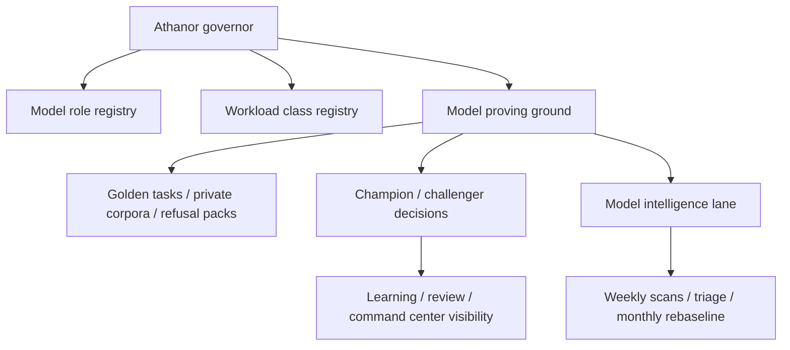

# Model Governance Atlas

This atlas page is the canonical map of Athanor's model-role registry, workload registry, and proving-ground/update program.

For the broader future-state program, see [../archive/design/automation-backbone-master-plan.md](../archive/design/automation-backbone-master-plan.md).

## Plain-language map

## Current status

| Layer | Purpose | Status | Source |
| --- | --- | --- | --- |
| Model role registry | Declares lane roles and champions | `live` | `config/automation-backbone/model-role-registry.json` |
| Workload class registry | Declares which lanes fit which workloads | `live` | `config/automation-backbone/workload-class-registry.json` |
| Command-rights registry | Declares which layers may decide or execute | `live` | `config/automation-backbone/command-rights-registry.json` |
| Policy class registry | Declares cloud/sovereign routing posture | `live` | `config/automation-backbone/policy-class-registry.json` |
| Contract registry | Declares the shared system records and owners | `live_partial` | `config/automation-backbone/contract-registry.json` + runtime governance snapshot |
| Eval corpus registry | Declares governed golden/private/refusal-sensitive corpora | `live_partial` | `config/automation-backbone/eval-corpus-registry.json` + runtime proving-ground snapshot |
| Model proving ground | Evaluates models, prompts, policies, and pipelines | `live` | `config/automation-backbone/model-proving-ground.json` + proving-ground runtime snapshot |
| Model intelligence lane | Tracks candidates, benchmark evidence, and rebaseline posture | `live` | `config/automation-backbone/model-intelligence-lane.json` + runtime-backed governance snapshot |
| Experiment ledger policy | Declares required evidence for promotion/rejection decisions | `live_partial` | `config/automation-backbone/experiment-ledger-policy.json` + runtime governance/proving-ground snapshots |
| Deprecation/retirement policy | Declares how models, prompts, policies, and experiments leave service | `live_partial` | `config/automation-backbone/deprecation-retirement-policy.json` + runtime retirement snapshot and governed action routes |

## Model role families

| Role | Plane | Champion | Status | Notes |
| --- | --- | --- | --- | --- |
| Frontier supervisor | frontier cloud | Claude | `live` | default strategic lead for cloud-safe work |
| Sovereign supervisor | sovereign local | `reasoning` | `live` | local co-equal strategic lead for protected workloads |
| Coding worker | local worker | `coding` | `live` | bulk implementation and repair |
| Bulk worker | local worker | `worker` | `live` | transforms, retries, background throughput |
| Creative worker | local worker | `creative` | `live` | creative and media-oriented generation |
| Judge / verifier | local judge | `judge-local-v1` | `live` | rubric scoring, regression gates, promotion checks |
| Embedding support | support | `embedding` | `live` | retrieval indexing |
| Reranker support | support | `reranker` | `live` | retrieval precision |

## Workload routing model

Each workload class declares:

- policy default
- frontier supervisor
- sovereign supervisor
- primary worker lane
- fallback worker lanes
- judge lane
- default autonomy
- parallelism posture

Current workload families include:

- architecture planning
- repo-wide audit
- coding implementation
- code review
- private automation
- research synthesis
- workplan generation
- background bulk transform
- refusal-sensitive creative generation
- explicit dialogue
- digest generation
- judge verification
- embedding
- reranking

## Proving-ground loop

The proving ground does not only test isolated models. It must also test:

- prompts
- policies
- lane selection
- full supervisor-worker pipelines

Core phases:

1. intake
2. benchmark
3. functional eval
4. policy eval
5. shadow
6. canary
7. promotion review

## Model intelligence cadence

The cadence is now surfaced live in model-governance snapshots. The weekly scan and monthly rebaseline remain governed by the configured cadence, while the operator-facing queue, benchmark counts, pending proposals, and next-action recommendations are runtime-backed.

| Cadence | Purpose |
| --- | --- |
| Weekly horizon scan | discover new model and infra candidates |
| Weekly candidate triage | decide what is worth evaluating |
| Monthly rebaseline | verify champions still win on Athanor's workloads |
| Urgent scan | react to major model or inference-engine releases |

## Operator-facing surfaces

| Surface | Purpose | Status |
| --- | --- | --- |
| `/v1/models/governance` | runtime snapshot of role/workload/proving-ground state | `live` |
| `/v1/models/proving-ground` | runtime proving-ground snapshot and benchmark trigger | `live` |
| `/v1/review/judges` | local judge-plane snapshot, verdict history, and challenger posture | `live` |
| `/api/models/governance` | dashboard proxy for model governance state | `live` |
| `/api/models/proving-ground` | dashboard proxy for proving-ground snapshot and trigger | `live` |
| `/api/review/judges` | dashboard proxy for judge-plane posture and recent verdicts | `live` |
| Command Center model-governance card | champion lanes and proving-ground cadence | `live` |
| Learning and review proving-ground cards | benchmark history, governed corpora, experiment evidence, and run trigger | `live` |
| Learning and review model-governance cards | operator-facing proving-ground, governed contract/corpus posture, and champion/challenger posture in the intelligence family | `live` |
| Command Center and intelligence-family judge-plane cards | judge posture, recent verdicts, and guardrails | `live` |
| Agents model-governance card | lane posture beside the system map and subscription controls | `live` |

## Live evidence now carried in the shared records

The current live backbone contract now links model-governance posture into runtime records instead of leaving it as detached documentation.

Execution runs and handoff records now carry:

- `judge_lane`
- `prompt_version`
- `policy_version`
- `corpus_version`
- `lineage`
- `artifact_provenance`

Command decisions and plan packets now carry:

- policy and contract-linked version posture
- workload registry lineage
- prompt/corpus version posture
- primary and fallback worker intent

That means proving-ground, prompt/policy governance, and experiment evidence are now part of the same runtime truth as task and provider execution, even though the broader promotion flow is still only `live_partial`.

The retirement ladder now uses the same live runtime truth:

- `/v1/models/governance/retirements`
- `/v1/models/governance/retirements/{retirement_id}/{action}`
- `/api/models/governance/retirements`
- `/api/models/governance/retirements/[retirementId]/advance`
- `/api/models/governance/retirements/[retirementId]/hold`
- `/api/models/governance/retirements/[retirementId]/rollback`

Those surfaces expose governed retirement candidates, recent retirement events, and synthetic retirement rehearsals, even though broader prompt/policy/corpus retirement flows still need deeper operator-driven execution.

## Source anchors

- `config/automation-backbone/model-role-registry.json`
- `config/automation-backbone/workload-class-registry.json`
- `config/automation-backbone/command-rights-registry.json`
- `config/automation-backbone/policy-class-registry.json`
- `config/automation-backbone/model-proving-ground.json`
- `config/automation-backbone/model-intelligence-lane.json`
- `projects/agents/src/athanor_agents/model_governance.py`
- `projects/agents/src/athanor_agents/command_hierarchy.py`
