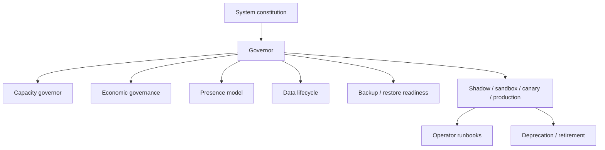

# Operations Atlas

This atlas page is the canonical map of Athanor's operational governance layers: constitution, capacity, economics, presence, lifecycle, restore posture, release tiers, runbooks, and retirement handling.

For the command chain itself, see [COMMAND_HIERARCHY_ATLAS.md](./COMMAND_HIERARCHY_ATLAS.md). For model roles, workloads, and proving-ground posture, see [MODEL_GOVERNANCE_ATLAS.md](./MODEL_GOVERNANCE_ATLAS.md).

## Plain-language map

## Current status

| Layer | Purpose | Status | Source |
| --- | --- | --- | --- |
| System constitution | no-go rules, sovereignty, approval bands, and local-only domains | `live` | `config/automation-backbone/system-constitution.json` |
| Capacity governor | queue, GPU, benchmark, and time-window arbitration | `live` | `config/automation-backbone/capacity-governor.json` + `projects/agents/src/athanor_agents/governor.py` |
| Economic governance | premium reserves, automatic spend lanes, and downgrade order | `live_partial` | `config/automation-backbone/economic-governance.json` + governor/provider snapshots |
| Presence model | at-desk / away / asleep / phone-only automation posture | `live_partial` | `config/automation-backbone/operator-presence-model.json` + dashboard heartbeat + governor snapshot |
| Data lifecycle registry | retention, cloud boundary, and backup class by data class | `live_partial` | `config/automation-backbone/data-lifecycle-registry.json` + governor operations snapshot and lifecycle verification flow |
| Backup and restore readiness | critical stores, cadence, recovery order, and non-destructive rehearsal evidence | `live_partial` | `config/automation-backbone/backup-restore-readiness.json` + operations-readiness snapshots |
| Release ritual | offline eval, shadow, sandbox, canary, production | `live_partial` | `config/automation-backbone/release-ritual.json` + promotion-ladder rehearsal and operations snapshot |
| Operator runbooks | routine and incident operating guidance | `live_partial` | `config/automation-backbone/operator-runbooks.json` + [`../operations/OPERATOR_RUNBOOKS.md`](../operations/OPERATOR_RUNBOOKS.md) |
| Deprecation and retirement policy | how models, prompts, policies, and experiments leave service | `live_partial` | `config/automation-backbone/deprecation-retirement-policy.json` + runtime retirement controls and rehearsal evidence |

## Constitution

The constitution is the highest non-human authority. It defines:

- what Athanor may never do automatically
- what must remain local-only
- which approval bands exist
- which rights the governor owns
- why sovereignty overrides cloud convenience

The system constitution is documented in [../design/system-constitution.md](../design/system-constitution.md).

## Runtime arbitration

The capacity governor is where Athanor stops being "many strong subsystems" and becomes one coherent runtime. Its job is to stop:

- interactive work and benchmarks fighting for the same GPUs
- backup/consolidation windows colliding with production activity
- cloud-harvesting or creative jobs starving higher-value operator work

It must eventually move from configured policy into live bounded arbitration.

## Operator posture

The presence model changes how aggressive Athanor should be:

- `at_desk`: low-friction approvals and full-detail notifications
- `away`: digest-heavy, more conservative automation
- `asleep`: safe recurring work only, critical alerts only
- `phone_only`: compact actionable approvals and bounded autonomy

Presence posture is now live through two sources:

- manual operator override via the governor controls
- automatic dashboard heartbeat that drives `at_desk` vs `away`

The governor snapshot exposes:

- effective presence state
- auto vs manual mode
- configured manual state
- heartbeat source and freshness
- reason for the current posture

## Restore and recovery

Critical stores currently tracked for restore posture:

- Redis critical state
- Qdrant memory
- Neo4j graph
- dashboard/agent deploy state

The recovery order is defined in the readiness registry, and the current runtime now captures non-destructive live rehearsal evidence against Redis, Qdrant, Neo4j, and deployment-state surfaces. Full destructive restore drills remain a tracked closeout item.

## Release tiers

No new model, prompt, policy, or autonomy loop should jump directly to production. The current ritual is:

1. offline eval
2. shadow
3. sandbox
4. canary
5. production

## Retirement handling

Retirement handling is no longer doc-only posture. The current live runtime now exposes:

- governed retirement candidate queues
- recent retirement events
- advance, hold, and rollback actions
- synthetic retirement-policy rehearsals in operator-test evidence

What remains is deeper asset-class coverage and richer operator-led retirement workflows across prompts, policies, corpora, and experiment history.

## Source anchors

- `config/automation-backbone/system-constitution.json`
- `config/automation-backbone/capacity-governor.json`
- `config/automation-backbone/economic-governance.json`
- `config/automation-backbone/operator-presence-model.json`
- `config/automation-backbone/data-lifecycle-registry.json`
- `config/automation-backbone/backup-restore-readiness.json`
- `config/automation-backbone/release-ritual.json`
- `config/automation-backbone/operator-runbooks.json`
- `config/automation-backbone/deprecation-retirement-policy.json`
- `projects/agents/src/athanor_agents/command_hierarchy.py`
- `projects/agents/src/athanor_agents/governor.py`
